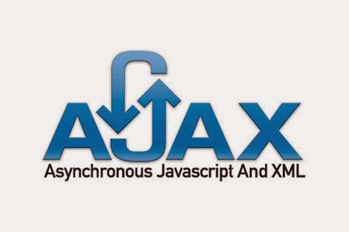
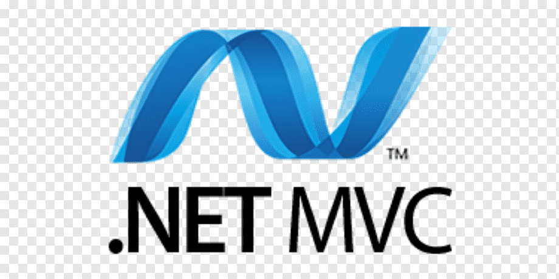

</img>  

<h2 align="center">Web Developer</h2>

## 📖  About Me
⚡ **Merhaba, ben [Bahadır Aksakal](https://www.linkedin.com/in/bahad%C4%B1r-aksakal-360b721b7/). Orta-Büyük işletmeler için evrak ve iş yükünü azaltan kağıt kullanımını mümkün**
**olduğunca en aza indiren iş-süreç takip yazılımları (ERP’ler) üzerinde çalışıyorum . Şuan [@Bursa Tehnik Üniversitesi](https://btu.edu.tr/) Bilgisayar Mühendsiliği 2. sınıf öğrencisiyim.**

## :computer: Yeteneklerim
<ul>
  <li>Java SE</li>
  <li>Java EE</li>
  <li>Apache Poi (Exel-Java-Database)</li>
  <li>Selenium (JAVA)</li>
  <li>MySQL</li>
  <li>JSF(2.3)</li>
  <li>PrimeFaces Lib</li>
  <li>Jqery</li>
  <li>Ajax</li>
  <li>Html</li>
  <li>C# SE</li>
  <li>ASP.NET</li>
  <li>Python SE</li>
  <li>C SE</li>
</ul>
 
 ## ⭐ Projelerim
* [Bankacılık Uygulaması](https://github.com/bahadraksakal/Java_Bahar_Donemi_Proje) 
* [Üyelik Sistemi Web Projesi](https://github.com/bahadraksakal/Uyelik_Sistemi_Projesi_JSF_2.3)  
* [ApachePOI Lib ile Exel Çalışmaları](https://github.com/bahadraksakal/ApachePOI_Excell_Selenium_MySQL_Ornek)  
* [Dil Tanıma](https://github.com/bahadraksakal/Guz_Donemi_Projem_1.Sinif-) 
* [My computational biology project.This project maps gene sequences](https://github.com/bahadraksakal/Java_HBG_Project) 

## 📬 Bana Ulaşın

	
  
  

