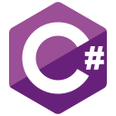
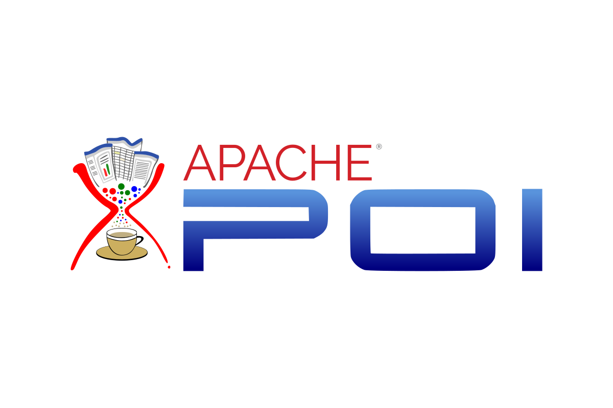

<link href="https://cdn.jsdelivr.net/npm/bootstrap@5.1.1/dist/css/bootstrap.min.css" rel="stylesheet" integrity="sha384-F3w7mX95PdgyTmZZMECAngseQB83DfGTowi0iMjiWaeVhAn4FJkqJByhZMI3AhiU" crossorigin="anonymous">
</img>  

<h2 align="center">Web-API/Back-End Developer</h2>

## 📖  Genel
⚡ **Merhaba, ben [Bahadır Aksakal](https://www.linkedin.com/in/bahad%C4%B1r-aksakal-360b721b7/). Orta-Büyük işletmeler için evrak ve iş yükünü azaltan kağıt kullanımını mümkün**
**olduğunca en aza indiren iş-süreç takip yazılımları (ERP’ler) üzerinde çalışıyorum . Şuan [@Bursa Tehnik Üniversitesi](https://btu.edu.tr/) Bilgisayar Mühendisliği 3. sınıf öğrencisiyim.**

## :1st_place_medal: Yetenekler
<ul>
  <li><strong>BackEnd</strong>: NodeJS (JavaScript), .NET</li>
  <li><strong>FrontEnd</strong>: Vue.js </li>
  <li><strong>Database</strong>: MongoDB, MySQL</li>
  <li><strong>DevOps</strong>: Docker</li>
</ul>      
 

## ⭐ Projelerim
| **:page_facing_up: Repolar**  | **:spiral_calendar:  Tarihler** |
| --- | --- |
| * [Bulus-Tanis-App](https://github.com/bahadraksakal/Bulus-Tanis-App) | 3. Sınıf Bahar Dönemi |
| * [Mobile-Authentication-App](https://github.com/bahadraksakal/Mobile-Authentication-App#tr) | 3. Sınıf Güz Dönemi |
| * [Blow Up Box-2 Game-Unity](https://github.com/bahadraksakal/OyunProgramlaFinalProje-BlowUpBox2) | 3. Sınıf Güz Dönemi |
| * [Hava Yolu Kayıt Oluşturma Sistemi](https://github.com/bahadraksakal/Hava-Yolu-Kayit-Sistemi) | 3. Sınıf Güz Dönemi |
| * [.NET-Programlama Dersi Vize Final Sorulari Cozumlerim](https://github.com/bahadraksakal/.NET-Programlama-Dersi-Vize-Final-Sorulari-Cozumlerim) | 3. Sınıf Güz Dönemi |
| * [BTÜ Bilgi İşlem Dairesinde Yaptığım Staj Projesi](https://github.com/bahadraksakal/Universite-Is-Talep-Takip) | 2. Sınıf Yaz Dönemi (Staj) |
| * [Dentist ERP - Dişçiler İçin İş Takip](https://github.com/bahadraksakal/Dentist-ERP-FULL) | 2. Sınıf Bahar Dönemi |
| * [Bahis Oyunu Tuttur Kazan BahoxBet](https://github.com/bahadraksakal/Bahis-Oyunu-Tuttur-Kazan-BahoxBet) | 2. Sınıf Bahar Dönemi |
| * [Mutant Karınca Game-JS](https://github.com/bahadraksakal/WepProgramlamaProje-JSGAME-MUTANT-KARINCA) | 2. Sınıf Bahar Dönemi |
| * [Hamming Code Bilgisayar Mimarisi Projesi](https://github.com/bahadraksakal/Hamming-Code-Genarator-With-Gui-2.-Sinif-Bilgisayar-Mimarisi-Dersi-Proje-Odevi) | 2. Sınıf Bahar Dönemi |
| * [Bankacılık Uygulaması](https://github.com/bahadraksakal/Java_Bahar_Donemi_Proje) | 1. Sınıf Bahar Dönemi |
| * [Similarity Of Gene Sequences - Align With Chi-Square - Computational Biology Project](https://github.com/bahadraksakal/Java_HBG_Project) | 1. Sınıf Bahar Dönemi |
| * [Dil Tanımla ve Doğal Dil İşleme Projesi](https://github.com/bahadraksakal/Guz_Donemi_Projem_1.Sinif-) | 1. Sınıf Güz Dönemi |

## 📬 Bana Ulaşın

         

            <table class="table table-striped table-bordered table-hover">
                <tbody>
                    <tr>
                        <td colspan="2" align="center"></td>
                    </tr>
                    <tr>
                        <td align="center"></td>
                        <td align="center"></td>              
                    </tr>                   
                </tbody>
            </table>

## :computer: Kullandığım Tüm Teknoloji Ve Diller

            <table>
                    <tr>
                        <td align="center" ></td>
                        <td align="center" ></td>
                <td align="center" ></td>
                        <td align="center" ></td>
                        <td align="center"></td>
                        <td align="center"></td>
                        <td align="center"></td>
                        <td  align="center" ></td>
                    </tr>
                    <tr>
                        <td align="center"></td>                        
                        <td align="center"></td>
                        <td align="center"></td>
<td align="center"></td>
                        <td align="center"></td>
                        <td align="center"></td>
                      <td align="center"></td>
                        <td align="center"></td>
                    </tr>
                    <tr>
               <td align="center" ></td>
                        <td align="center" ></td>
            <td align="center" ></td>
                        <td align="center" ></td>
                        <td align="center"></td>
                        <td align="center"></td>
                        <td align="center"></td>
                        <td align="center"></td>
                    </tr>  
                   <tr>
                  <td align="center" ></td>
                        <td align="center" ></td>
                 <td align="center" ></td>
                        <td align="center" ></td>
                        <td align="center"></td>
                        <td align="center"></td>
                        <td align="center"></td>
                        <td align="center"></td>
                    </tr> 
            </table>

